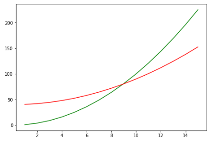
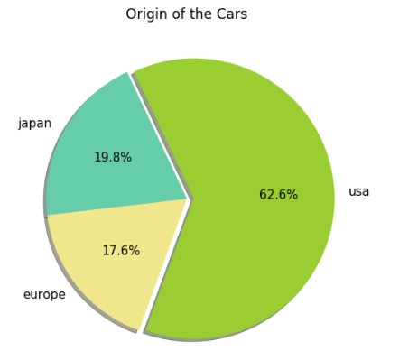

# Matplotlib

```python
pip install matplotlib
```

## Introduction to Data Visualization

Data Visualization is a concept of graphical representation of data or information using visual elements like graphs, charts, and maps. This representation helps us in understanding the patterns, trends, and outliers in the data and it makes data easily understandable and explainable. 

With the increase in the volume of data, discovering the patterns in data has become challenging. By making use of data visualization, a huge chunk of complex data can be displayed in a way that is easy to understand and is also appealing to the eyes.

In Data Visualization, plot is a basic structure for the graphical representation of data. Let us understand the plot and its components.

### Plot

A plot is the basic visualization element that helps to visualize the data. To visualize(plot) the data, required is figure and axes objects.

* `Figure:` The Figure is the top-level container that acts as the window or page on which everything is drawn. It can contain multiple independent subplots, multiple Axes, a title, a legend, etc.

* `Axes:` The Axes are the area on which data is plotted. It can have labels or ticks associated with it. There can be multiple Axes in a figure. But a given Axes object can only be in one figure.

Let us understand Axes, Figures, and Plots with the help of the images below:


A plot comprises several elements such as title, label, axes, legend etc., that adds more meaning to the visualization. A sample representation of the plots is shown below.


Now let us understand the components of a plot.

* `Title :` The title is the name of the plot. By default, the title will be present at the top-center of the plot.

* `Axis :` This consists of the X and Y axis which provide the horizontal and vertical coordinates of the data points.

* `Labels :` The labels are used to name the X and Y axis with appropriate names respectively.

* `Legend :` A legend is a set of key-value pairs that contains the list of plots and their respective labels.

Apart from these, there are several customizations available for specific plots.

## Introduction to Matplotlib

Matplotlib is one of the most basic and popular Python libraries used for data visualization. It was developed for imitating the plotting capabilities of MATLAB.

`matplotlib.pyplot` is used for tow-dimensional graphics in python programming. It can be used in python shell, scripts, web application servers, and other graphical user interface toolkits.

Matplotlib uses libraries such as NumPy as a base for underlying operations.

Following are the various approaches to plotting in Matplotlib:

1. MATLAB way of plotting using matplotlib.plyplot. It is simple to use
2. Object-Oriented way of plotting for more control and customization

### Importing Matplotlib

To make use of the functionalities that are present in Matplotlib library, the package must be imported into the environment. Matplotlib can be imported to the local environment or IDE using:

```python
import matplotlib.pyplot as plt
```

'plt' is the standard alias used for pyplot module of Matplotlib.

### Creating  a simple Plot using Matplotlib.pyplot

```python
#importing the required packages
import matplotlib.pyplot as plt
import numpy as np
```

```python
#creating two arrays
X = np.array([1,2,3,4,5])
Y = X**2
```

Now, let us plot the values using matplotlib.pyplot.

Syntax:
```
plt.plot(x, y)
```
`x` = data on the horizontal axis

`y` = data on the vertical axis 

```python
#plotting the values
plt.plot(X,Y)
plt.show()
```

**Output:**


matplotlib.pyplot is the simplest way of plotting. It creates the default elements like Figure and Axes required and then plots the data. This approach can be used to plot different kinds of graphs  like Line, Bar, Scatter plots, histogram etc.


## Object Oriented Interface in Matplotlib

We can also create the plotting elements using object oriented approach. The use of an object-oriented approach is recommended as it gives more control over customization of the plots.

Now, let us recreate the plot using object oriented approach following the below steps:

* Creating a figure
* Setting up the axes
* Creating a plot using the axes object
* Creating multiple plots using the same axes object
* Setting up the title, label, and legend for a plot

Creating sample data for plotting as below:

```python
#creating sample data for plotting
x = np.arange(1,16)    #1 … 15
y = x**2    #square of x values
z = (y/2)+40    #arithmetic operation applied to y values
```

**Step 1:**
Creating an empty canvas or figure, to plot the values and visualize the plot.

```python
#creating an empty canvas/figure
fig = plt.figure()
```
Output: 
```
<Figure size 432x288 with 0 Axes>
```

**Step 2:**
Setting the axes for the figure.

The axes object is the region where the data can be plotted. A figure can have n number of axes object.

```python
#creating an empty canvas/figure
fig = plt.figure()
#setting axes as [left, bottom, width, height]
ax = fig.add_axes([0.1, 0.1, 0.8, 0.8])  # 10% margin on all sides
plt.show()
```


**Step 3:**
Plotting a line on the axes.

Syntax:
```python
ax.plot(x, y, color, label) #ax represents axes
```
`x` = data on the horizontal axis

`y` = data on the vertical axis

```python
#creating an empty canvas/figure
fig = plt.figure()
#setting axes
ax = fig.add_axes([0.1, 0.1, 0.8, 0.8])  # 10% margin on all sides
#plotting the lines
ax.plot(x,y,color="g",label='line1' )
plt.show()
```


**Step 4:**
Plotting multiple lines on the axes.

```python
X = np.array([1, 2, 3, 4, 5])
Y = X ** 2
Z = np.array([3, 4, 5, 6, 7])

#creating an empty canvas/figure
fig = plt.figure()
#setting axes
ax = fig.add_axes([0.1, 0.1, 0.8, 0.8])  # 10% margin on all sides
#plotting the lines
ax.plot(X, Y, color="g", label='line1')
ax.plot(X, Z, color="r", label='line2')
plt.show()
```



**Step 5:**
Setting the title for the plot and the labels for the axes.

```python
# Setting axes
ax = fig.add_axes([0.1, 0.1, 0.8, 0.8])  # 10% margin on all sides

# Plotting the lines
ax.plot(X, Y, color="g", label='line1')
ax.plot(X, Z, color="r", label='line2')

# Setting title and labels
ax.set_title('Title of the Plot', fontsize=15)
ax.set_xlabel('Label for X axis', fontsize=15)
ax.set_ylabel('Label for Y axis', fontsize=15)

# Adding a legend
ax.legend()

# Display the plot
plt.show()

```


Next, let us learn to plot multiple axes in a figure.

Let us plot line1 and line2 in different axes.

```python
import matplotlib.pyplot as plt
import numpy as np

# creating sample data for plotting
x = np.arange(1, 16)  # 1 … 15
y = x ** 2  # square of x values
z = (y / 2) + 40  # arithmetic operation applied to y values

# creating an empty canvas/figure
fig = plt.figure(figsize=(8, 5))

# setting axes as [left, bottom, width, height]
ax1 = fig.add_axes([0.1, 0.1, 0.8, 0.8])
ax2 = fig.add_axes([0.20, 0.47, 0.35, 0.35])

# plotting the lines
ax1.plot(x, y, color="g", label='line1')
ax1.set_title('Title for Plot 1', fontsize=15)  # setting title
ax1.set_xlabel('Plot 1 - X axis', fontsize=15)  # setting X label
ax1.set_ylabel('Plot 1 - Y axis', fontsize=15)  # setting Y _label

ax2.plot(x, z, color="r", label='line2')
ax2.set_title('Title for Plot 2', fontsize=15)  # setting title
ax2.set_xlabel('Plot 2 - X axis', fontsize=15)  # setting X label
ax2.set_ylabel('Plot 2 - Y axis', fontsize=15)  # setting Y _label

ax1.legend()  # adding legend
ax2.legend()

# Display the plot
plt.show()
```

**Output:**


Here, two plots are created using two different axes (ax1,ax2). Though it seems like plot 2 is embedded in plot 1 due to the placement of the axes, plot 1 and plot 2 are completely different plots and can only be accessed through ax1 and ax2 respectively.

The subplots method is used to create a common layout for multiple plots. 'm x n' number of plots can be created using a subplot where m and n represent the number of rows and columns respectively.

Now, let us create a subplot that has 1 row and 2 columns.

Syntax:
```
plt.subplots(nrows, ncols)
```

```python
import matplotlib.pyplot as plt
import numpy as np

# creating sample data for plotting
x = np.arange(1, 16)  # 1 … 15
y = x ** 2  # square of x values
z = (y / 2) + 40  # arithmetic operation applied to y values

# initializing two axes for the subplot
fig, (ax1, ax2) = plt.subplots(1, 2)

ax1.plot(x, y, color="g", label='line1')
ax1.set_title('Title for Plot 1', fontsize=15)  # setting title
ax1.set_xlabel('Plot 1 - X axis', fontsize=15)  # setting X label
ax1.set_ylabel('Plot 1 - Y axis', fontsize=15)  # setting Y _label

ax2.plot(x, z, color="r", label='line2')
ax2.set_title('Title for Plot 2', fontsize=15)  # setting title
ax2.set_xlabel('Plot 2 - X axis', fontsize=15)  # setting X label
ax2.set_ylabel('Plot 2 - Y axis', fontsize=15)  # setting Y _label

# Display the plot
plt.show()
```
**Output:**


A subplot is crested with two different plots aligned in 1 row and 2 columns. In this plot, it is seen that the y_label of the second plot is overlapping with the first plot. To avoid this, ‘`fig.tight_layout()`’ must be added.

```python
import matplotlib.pyplot as plt
import numpy as np

# creating sample data for plotting
x = np.arange(1, 16)  # 1 … 15
y = x ** 2  # square of x values
z = (y / 2) + 40  # arithmetic operation applied to y values

# initializing two axes for the subplot
fig, (ax1, ax2) = plt.subplots(1, 2)

ax1.plot(x, y, color="g", label='line1')
ax1.set_title('Title for Plot 1', fontsize=15)  # setting title
ax1.set_xlabel('Plot 1 - X axis', fontsize=15)  # setting X label
ax1.set_ylabel('Plot 1 - Y axis', fontsize=15)  # setting Y _label

ax2.plot(x, z, color="r", label='line2')
ax2.set_title('Title for Plot 2', fontsize=15)  # setting title
ax2.set_xlabel('Plot 2 - X axis', fontsize=15)  # setting X label
ax2.set_ylabel('Plot 2 - Y axis', fontsize=15)  # setting Y _label

fig.tight_layout()

# Display the plot
plt.show()
```

The output after adding ‘`fig.tight_layout()`’ will be as follows.


## Types of plots

By now you know to import the data as a DataFrame, pre-process it, explore and gain insights from it using the Pandas library.

Deeper insights can be gained from the data by visualizing it using Matplotlib. Matplotlib has several kinds of plots. These plots can be used to get a visual understanding of various features present in the data, analyze them better, and present the data to the stakeholders.

So, let us visualize the data using Matplotlib.

Download dataset [auto_mpg.csv](https://github.com/Soumyajit7/Python-Notes/blob/main/TestData/auto_mpg.csv).

```python
import pandas as pd
#importing the data
df = pd.read_csv('auto_mpg.csv')
df.info()    #to know the column names, missing values and their data type
```


There are some null values observed in the ‘horsepower’ column. These needs to be replaced. 

```python
#replacing the null values in 'horsepower' with its mean value
df['horsepower'].fillna(df['horsepower'].mean(), inplace=True)
```

This transformed data is used to visualize using different kinds of plots available in Matplotlib library.

A boxplot gives a good indication of distribution of data about the median. Boxplots are a standardized way of displaying the distribution of data based on the five-number summary (“minimum”, first quartile (Q1), median, third quartile (Q3), and “maximum”).


**Problem Statement:**

Some customers of XYZ Custom Cars are interested in the mileage range of the cars that are restored by the company. They also want to compare the distribution of average mileage and city mileage (25% less than the average mileage).

**Solution:**

First, let us plot the average mileage ‘mpg’ from the data using a boxplot.

**Syntax:**
```python
ax.boxplot(data)  # ax represents axes
```

```python
# importing the required packages
import matplotlib.pyplot as plt

# creating an empty canvas/figure
fig = plt.figure(figsize=[6, 6])

# setting axes
ax = fig.add_axes([0.1, 0.1, 0.8, 0.8])  # 10% margin on all sides
ax.set_title('Distribution of mileage')
# plotting boxplot
ax.boxplot(df['mpg'])
plt.show()
```


There is no data for city mileage, but city mileage is 25% less than the average mileage i.e. ‘mpg’. Next is to process the data for city mileage.

```python
# processing data for city mileage
df['city_mileage'] = df['mpg'] * 0.75
print(df.head())
```


A new column  ‘city_mileage’ is created . Next, the distribution of the average mileage and city mileage has to be compared.

```python
# processing data for city mileage
df['city_mileage'] = df['mpg'] * 0.75

# Comparing avarage mpg and city mpg using boxplot
mpg_list = [df['mpg'], df['city_mileage']]

# creating an empty canvas/figure
fig = plt.figure(figsize=[6, 5])

# setting axes
ax = fig.add_axes([0.1, 0.1, 0.8, 0.8])  # 10% margin on all sides
ax.set_title('Distribution of Average MPG vs City MPG')
ax.set_ylabel('Mileage per gallon')

# plotting box plot
ax.boxplot(mpg_list, widths=0.5)
plt.show()
```


A scatter plot uses dots or markers to represent a value on the axes. The scatter plot is one of the simplest plots which can accept both quantitative and qualitative values, with a wide variety of applications in primitive data analysis. 

Several meaningful insights can be drawn from a scatter plot. For example, identifying the type of correlation between variables before diving deeper into predictions.


**Problem Statement:**

The engineers at XYZ Custom Cars want to infer the correlation between horsepower and mileage. 

**Solution:**

First, let us plot a scatter plot for horsepower and mileage.

Syntax:
```python
ax.scatter(x, y, marker) # ax represents axes
```
`x` = data on the horizontal axis

`y` = data on the vertical axis

`marker` = shape of data points (example 'o' for circles, 's' for squares etc.)


```python
# visualizing correlation between mileage and horsepower
import matplotlib.pyplot as plt
import pandas as pd

df = pd.read_csv('./TestData/auto_mpg.csv')

# creating an empty canvas/figure
fig = plt.figure(figsize=[10, 5])

# setting axes
ax = fig.add_axes([0.1, 0.1, 0.8, 0.8])  # 10% margin on all sides

# plotting scatter plot
ax.scatter(df['horsepower'], df['mpg'])
ax.set_title("Scatter plot of horsepower and mileage", fontsize=16)
ax.set_ylabel('Mileage per gallon', fontsize=12)
ax.set_xlabel('Horsepower', fontsize=12)
plt.show()
```


A bar chart is a graph with rectangular bars that usually compare different categories. Each bar represents a particular category. The length of the bar indicates the total number of values or items in that category. 

The bar graphs can be plotted vertically or horizontally. The example shown below shows the number of cars manufactured by each company.


**Problem Statement:**

The engineers at XYZ Custom Cars want to know the number of cars released in each year. 

**Solution:**

A bar graph can be created for this problem as shown below:

Syntax:
```python
ax.scatter(x, height, width, bottom, align)     # ax represents axes
```
`x` = data on the horizontal axis

`height` = height of the bar

`weight` = weight of the bar. default:0.8

`bottom` = Y coordinates of bar bases. default:0

`align` = alignment of the bars to x coordinates. default value: 'center'


```python
import matplotlib.pyplot as plt
import pandas as pd

# Sample data
df = pd.read_csv('./TestData/auto_mpg.csv')

# Group by model year and count the number of cars
grouped_df = df.groupby(['model year']).count()[['car name']]
grouped_df.reset_index(inplace=True)

# Creating an empty canvas/figure
fig = plt.figure(figsize=[7, 5])

# Setting axes
ax = fig.add_axes([0.1, 0.1, 0.8, 0.8])  # 10% margin on all sides
ax.set_title("Number of cars in each year", fontsize=16)
ax.set_ylabel('Number of cars', fontsize=12)
ax.set_xlabel('Model year', fontsize=12)

# Plotting bar graph
ax.bar(grouped_df['model year'], grouped_df['car name'])
plt.show()
```


A histogram also represents data as rectangular bars. Unlike the bar graph, It is used for continuous data. Each bar groups the numbers into intervals (bins) and the height of the bar is based on the number of values that fall into the corresponding intervals. 

A histogram is ideally suited to obtain the frequency distribution of a given data and one such example is shown below.


**Problem Statement:**

The engineers at XYZ Custom Cars want to identify the distribution of horsepower.

**Solution:**

This can be done with the help of a histogram as follows:

Syntax:
```python
ax.hist(x, bins) # ax represents axes
```

`x` = Input values. single array or sequence of arrays

`bins` = int or sequence or str. If bins is integer, it defines the number of equal-width bins in the range.


```python
import matplotlib.pyplot as plt
import pandas as pd

df = pd.read_csv('./TestData/auto_mpg.csv')
# creating an empty canvas/figure
fig = plt.figure(figsize=[8, 6])
# setting axes
ax = fig.add_axes([0.1, 0.1, 0.8, 0.8])  # 10% margin on all sides
# plotting histogram
ax.hist(df['horsepower'], bins=20)
ax.set_title('Distribution of Horsepower', fontsize=17)
ax.set_ylabel('Frequency', fontsize=12)
ax.set_xlabel('Horsepower', fontsize=12)
plt.show()
```


From the histogram, it is observed that most of the cars, have the horsepower value ranging between 70 and 110. 

A Pie chart divides the entire dataset into distinct groups. The chart consists of a circle split into pies and each pie represents a group. The size of the pie is proportional to the number of items in each group compared to others. 

The sum of the pies in a pie chart will always be 100%. An example of a pie chart is shown below.


**Problem Statement:**

The management of XYZ Custom Cars has decided to open a new branch and is yet to decide the location. They would like to concentrate more on the ‘origin’ of the cars to make a better decision.

**Solution:**

The details on origin of the cars and their numbers can be presented to the stakeholders visually for their easy understanding.

Let us visualize the data using a pie chart as follows:

**Syntax:**
```python
ax.pie(x, labels) # ax represents axes
```
`x` = wedge size. one-dimensional array

`labels` = sequence of strings providing the label for wedges

```python
import pandas as pd

df = pd.read_csv('./TestData/auto_mpg.csv')

pie_df = pd.DataFrame()  # creating a sub dataframe to plot the pie chart
pie_df['Count'] = df['origin'].value_counts()  # getting the count of ‘origin’ and assigning to the df
pie_df = pie_df.reset_index()  # re-arranging the index
pie_df.rename(columns={'origin': 'Country'}, inplace=True)  # re-naming the col
print(pie_df)
```


```python
import matplotlib.pyplot as plt
import pandas as pd

df = pd.read_csv('./TestData/auto_mpg.csv')

pie_df = pd.DataFrame()  # creating a sub dataframe to plot the pie chart
pie_df['Count'] = df['origin'].value_counts()  # getting the count of ‘origin’ and assigning to the df
pie_df = pie_df.reset_index()  # re-arranging the index
pie_df.rename(columns={'origin': 'Country'}, inplace=True)  # re-naming the col
print(pie_df)

# creating an empty canvas/figure
fig = plt.figure(figsize=[8, 6])
# setting axes
ax = fig.add_axes([0.1, 0.1, 0.8, 0.8])  # 10% margin on all sides
ax.set_title('Origin of the Cars')
# plotting pie chart
ax.pie(pie_df['Count'], labels=pie_df['Country'])
plt.show()
```


A basic Pie chart has been plotted using the ax.pie() function in matplotlib. This plot could also be made visually appealing by customizing other parameters present in the ax.pie() function.

Following are the parameters:

`explode` - To get an elevated view for the selected pie. 

`colors` - To customize the colors for the plot.

`autopct` - To add the percentage of the distribution in the pie chart.

`shadow` - To add shadow to the plot.

`startangle` - To change the starting angle of the pie chart.


```python
import matplotlib.pyplot as plt
import pandas as pd

df = pd.read_csv('./TestData/auto_mpg.csv')

pie_df = pd.DataFrame()  # creating a sub dataframe to plot the pie chart
pie_df['Count'] = df['origin'].value_counts()  # getting the count of ‘origin’ and assigning to the df
pie_df = pie_df.reset_index()  # re-arranging the index
pie_df.rename(columns={'origin': 'Country'}, inplace=True)  # re-naming the col
print(pie_df)

fig = plt.figure(figsize=[8, 6])
ax = fig.add_axes([0, 0, 1, 1])
explode = [0.05, 0, 0]
colors = ['yellowgreen', 'mediumaquamarine', 'khaki']
ax.set_title('Origin of the Cars')
ax.pie(pie_df['Count'], labels=pie_df['Country'],
       autopct='%0.1f%%', explode=explode,
       shadow=True, startangle=250,
       colors=colors)
plt.show()
```



From the plot above, following are the insights:

1. Which will be the most suitable region to start a new branch?

    **Answer:** USA

2. What is the percentage of cars produced from Japan?

    **Answer:** 17.6%

### Line Chart

Line Chart is drawn by interconnecting all data points using straight line segments in sequential order. It is used to analyze historic variations and trends in data. The individual data points are chronologically connected to obtain the patterns and draw meaningful inferences.

An image depicting the changes in the stock prices over time is shown below.


**Problem Statement:**

XYZ Custom Cars is planning to generate a report comparing the Mileage, Horsepower, and Weight of the cars manufactured in different years, starting from 1970 to 1982.

**Solution:**

As a data analyst, a line chart can be created to visualize the relationship between mileage, horsepower, and the weight of the cars manufactured in different years.

Let us create a DataFrame containing the mean values of mileage, horsepower and the weight of the cars based on the model year.

```python
line_df = df.groupby(by=['model_year'])
line_df = line_df.mean()  # creating a sub dataframe for the line graph
```

Now, let us plot the line chart for the scenario.

```python
import matplotlib.pyplot as plt
import pandas as pd

# Read the CSV file
df = pd.read_csv('./TestData/auto_mpg.csv', na_values='?')

line_df = df.groupby('model_year')
line_df = line_df.mean(numeric_only=True)  # creating a sub dataframe for the line graph

# creating an empty canvas/figure
fig = plt.figure(figsize=[8, 4])

# setting axes
ax = fig.add_axes([0.1, 0.1, 0.8, 0.8])  # 10% margin on all sides

# plotting the lines
ax.plot(line_df['mpg'] / 10, label='Mileage /10')
ax.plot(line_df['weight'] / 1000, label='Weight /1000')
ax.plot(line_df['horsepower'] / 100, label='Horsepower /100')
ax.set_title('Mileage vs Weight vs Horsepower', fontsize=17)
ax.set_ylabel('Value', fontsize=12)
ax.set_xlabel('Model year', fontsize=12)
ax.legend()
plt.show()
```


### Linestyle

Matplotlib supports several line styles such as solid line, dashed line (-----), dotted line (…..), dashdot (-.-.-.-) etc. In addition to color and linestyle, the width of the line can be customized to get a unique plot.

Below is a small example of how linestyle, width, and color can be used.

```python
import matplotlib.pyplot as plt
import pandas as pd

# Read the CSV file
df = pd.read_csv('./TestData/auto_mpg.csv', na_values='?')

line_df = df.groupby('model_year')
line_df = line_df.mean(numeric_only=True)  # creating a sub dataframe for the line graph

# creating an empty canvas/figure
fig = plt.figure(figsize=[8, 4])

# setting axes
ax = fig.add_axes([0.1, 0.1, 0.8, 0.8])  # 10% margin on all sides

# plotting the lines
ax.plot(line_df['mpg'] / 10, label='Mileage', linestyle='-', linewidth=2)
ax.plot(line_df['weight'] / 1000, label='Weight', linestyle=':', linewidth=3)
ax.plot(line_df['horsepower'] / 100, label='Horsepower', linestyle='--', linewidth=3)

# possible linestype options ‘-‘, ‘–’, ‘-.’, ‘:’
ax.set_title('Mileage vs Weight vs Horsepower', fontsize=17)
ax.set_ylabel('Value', fontsize=12)
ax.set_xlabel('Model year', fontsize=12)
ax.legend()
plt.show()
```


### Text and Annotate

In addition to adding the title and axis names, text can also be added to describe a plot. Let us learn to add text for a plot using the ‘plt.text()’ function as shown below:

```python
import matplotlib.pyplot as plt
import pandas as pd

# Read the CSV file
df = pd.read_csv('./TestData/auto_mpg.csv', na_values='?')

line_df = df.groupby('model_year')
line_df = line_df.mean(numeric_only=True)  # creating a sub dataframe for the line graph

# creating an empty canvas/figure
fig = plt.figure(figsize=[10, 5])

# setting axes
ax = fig.add_axes([0.1, 0.1, 0.8, 0.8])

# plotting the lines
ax.plot(line_df['mpg'] / 10, label='Mileage')
ax.plot(line_df['weight'] / 1000, label='Weight')
ax.plot(line_df['horsepower'] / 100, label='Horsepower')
plt.text(75.5, 1.14, 'Horsepower',
         va='center',  # va -> vertical alignment
         rotation=4,  # angle
         bbox=dict(
             boxstyle='round',
             facecolor='wheat',
             alpha=0.3))  # background style
plt.text(75.5, 2.25, 'Mileage', va='center', rotation=17, bbox=dict(boxstyle='round', facecolor='wheat', alpha=0.3))
plt.text(76, 3.15, 'Weight', va='center', rotation=-13, bbox=dict(boxstyle='round', facecolor='wheat', alpha=0.3))
plt.annotate('Highest Mileage', xy=(80.1, 3.39), xytext=(80.5, 3.38), arrowprops=dict(facecolor='wheat', shrink=.01))
plt.annotate('Lowest Mileage', xy=(73.05, 1.70), xytext=(73.5, 1.69), arrowprops=dict(facecolor='wheat', shrink=.01))
ax.set_title('Mileage vs Weight vs Horsepower', fontsize=17)
ax.set_ylabel('Value', fontsize=12)
ax.set_xlabel('Model year', fontsize=12)
plt.show()
```


### Markers

Markers are used to highlight the intercepts in a plot. There are several types of markers such as ‘o’, ‘s’, ‘x’,’+’, etc. Let us learn to use the marker parameter in a plot as follows:

```python
import matplotlib.pyplot as plt
import pandas as pd

# Read the CSV file
df = pd.read_csv('./TestData/auto_mpg.csv', na_values='?')

line_df = df.groupby('model_year')
line_df = line_df.mean(numeric_only=True)  # creating a sub dataframe for the line graph

# creating an empty canvas/figure
fig = plt.figure(figsize=[8, 4])

# setting axes
ax = fig.add_axes([0.1, 0.1, 0.8, 0.8])

# plotting the lines
ax.plot(line_df['mpg'] / 10, label='Mileage', color="g", marker='+', markersize=7)
ax.plot(line_df['weight'] / 1000, label='Weight', color="b", marker='o', markersize=7)
ax.plot(line_df['horsepower'] / 100, label='Horsepower', color="r", marker='s', markersize=7)

# possible marker symbols: marker = '+', 'o', '*', 's', ',', '.', '1', '2', '3', '4', ...
ax.set_title('Mileage vs Weight vs Horsepower', fontsize=17)
ax.set_ylabel('Value', fontsize=12)
ax.set_xlabel('Model year', fontsize=12)
ax.legend()
plt.show()
```


Based on the plot above,  following are the insights:

1. In which year the highest mileage was recorded?

    **Answer:** 1980

2. Mileage and Horsepower are negatively correlated.


## Appendix

### Saving a Figure with `fig.savefig()`

```python
fig.savefig("multiple-axes-plots.jpg", dpi=200)
```

- **`fig.savefig()`**: This method is used to save the figure created using Matplotlib.
- **`"multiple-axes-plots.jpg"`**: This is the filename and format in which the figure will be saved. In this case, it's a JPEG file.
- **`dpi=200`**: DPI stands for "dots per inch." It controls the resolution of the saved image. A higher DPI value means a higher resolution image.

### Saving a Plot with `plt.savefig()`

```python
plt.savefig("filename.jpg", dpi=200)
```

- **`plt.savefig()`**: This method is used to save the current figure or plot created using Matplotlib's `pyplot` interface.
- **`"filename.jpg"`**: This is the filename and format in which the plot will be saved. In this case, it's a JPEG file.
- **`dpi=200`**: Similar to the previous example, this sets the resolution of the saved image.

### Key Differences

- **`fig.savefig()`**: This is used when you have a figure object (`fig`) and you want to save it directly.
- **`plt.savefig()`**: This is used when you are working with the `pyplot` interface and want to save the current active figure.

Both methods are useful for saving your visualizations to a file, allowing you to share or use them in reports and presentations.

### Seaborn
Seaborn is a statistical data visualization library in python. It is integrated to work with Pandas DataFrames with a straight forward approach. 

Seaborn extends the plotting capabilities of Matplotlib and provides a high-level interface to generate attractive plots that are visually appealing.

### Plotly
Plotly is another data visualization library that is used to generate highly interactive plots. 


## Matplotlib Exercise

**Problem Statement:**

Given the following values for x and y, use Matplotlib to plot the figure shown below:

```python
import numpy as np

# Given values for x and y
x = np.arange(0.0, 5.0, 0.1)
y = np.cos(2 * np.pi * x) * np.exp(-x)
```

**Expected Output:**


**Solution:**

```python
import numpy as np
import matplotlib.pyplot as plt

# Given values for x and y
x = np.arange(0.0, 5.0, 0.1)
y = np.cos(2 * np.pi * x) * np.exp(-x)

# Creating the plot
fig, ax = plt.subplots()
ax.plot(x, y, 'c-', marker='o', markersize=5)  # 'c-' for cyan line

# Adding annotations
ax.annotate('2nd crest', xy=(1.5, 0.5), xytext=(2, 0.75),
            arrowprops=dict(facecolor='black', shrink=0.05))
ax.annotate(r'$\theta = 60^\circ$', xy=(2.5, 0.25), xytext=(3, 0.5),
            arrowprops=dict(facecolor='black', shrink=0.05))

# Adding titles and labels
ax.set_title('Main heading')
ax.set_xlabel('Abscissa')
ax.set_ylabel('Ordinate')

# Adding figure title
fig.suptitle('Figure Title')

# Displaying the plot
plt.show()
```