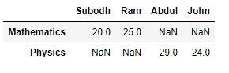
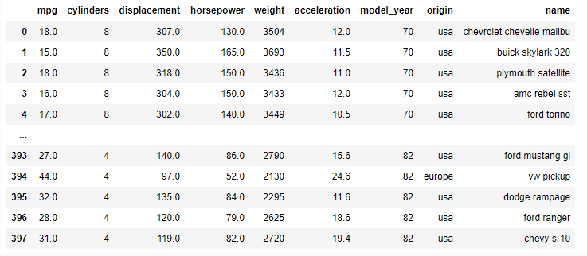
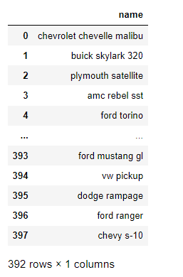

# Pandas

```python
pip install pandas
```

## Introduction to Pandas

Pandas is an open-source library for real world data analysis in python. It is built on top of Numpy. Using Pandas, data can be cleaned, transformed, manipulated, and analyzed. It is suited for different kinds of data including tabular as in a SQL table or a Excel spreadsheets, time series data, observational or statistical datasets.

The steps involved to perform data analysis using Pandas are as follows:


### Reading the data

The first step is to read the data. There are multiple formats in which data can be obtained such as '.csv', '.json', '.xlsx' etc.

Below are the examples:

#### Example of an excel file:


#### Example of a json (javascript object notation) file:


#### Example of a csv (comma separated values) file:


### Exploring the data

The next step is to explore the data. Exploring data helps to:

- know the shape(number of rows and columns) of the data
- understand the nature of the data by obtaining subsets of the data
- identify missing values and treat them accordingly
- get insights about the data using descriptive statistics

### Performing operations on the data

Some of the operations supported by pandas for data manipulation are as follows:

- Grouping operations
- Sorting operations
- Masking operations
- Merging operations
- Concatenating operations

### Visualizing data

The next step is to visualize the data to get a clear picture of various relationshipsamong the data. The following plots can help visualize the data:

- Scatter plot
- Box plot
- Bar plot
- Histogram and many more

### Generating Insights

All the above steps help generating insights about our data.

Pandas is one of the most popular data wrangling and analysis tools because it:

- has the capability to load huge sizes of data easily
- provides us with extremely streamlined forms of data representation
- can handle heterogenous data, has extensive set of data manipulation features and makes data flexible and customizable

## Introduction to Pandas objects

To get started with Pandas, Numpy and Pandas needs to be imported as shown below:

```python
#Importing libraries
#python library for numerical and scientific computing. pandas is built on top of numpy
import numpy as np
#importing pandas
import pandas as pd
```

In a nutshell, Pandas objects are advanced versions of NumPy structured arrays in which the rows and columns are identified with labels instead of simple integer indices.

The basic data structures of Pandas are Series and DataFrame.

Series is one dimensional labelled array. It supports different datatypes like integer, float, string etc. Let us understand more about series with the following example.

Consider the scenario where marks of students are given as shown in the following table:

| Student ID | Marks |
| ---------- | ----- |
| 1          | 78    |
| 2          | 92    |
| 3          | 36    |
| 4          | 64    |
| 5          | 89    |

The pandas series object can be used to represent this data in a meaningful manner. Series is created using the following syntax:

Syntax:

`pd.Series(data, index, dtype)`

`data` – It can be a list, a list of lists or even a dictionary.

`index` – The index can be explicitly defined for different valuesif required.

`dtype` – This represents the data type used in the series (optional parameter).

```python
series = pd.Series(data = [78, 92, 36, 64, 89])
print(series)
```


As shown in the above output, the series object provides the values along with their index attributes.

`Series.values` provides the values.

```python
print(series.values)
```


`Series.index` provides the index.

```python
print(series.index)
```


### Accessing data in series:

Data can be accessed by the associated index using [ ].

```python
print(series[1])
```


### Slicing a series:

```python
print(series[1:3])
```


By default, series creates an integer index. The custom index can also be defined.

For example, consider the following table containing car details:

| Car Name | Car Price (₹) |
| -------- | ------------- |
| Swift    | 7,00,000      |
| Jazz     | 8,00,000      |
| Civic    | 16,00,000     |
| Altis    | 18,00,000     |
| Gallardo | 3,00,00,000   |

A Pandas series can be created using the following syntax:

```python
data = pd.Series(data = [700000, 800000, 1600000, 1800000, 30000000], index = ['Swift', 'Jazz', 'Civic', 'Altis', 'Gallardo'])
print(data)
```


Values can be accessed as:

```python
print(data['Swift'])
```


```python
print(data['Jazz': 'Gallardo'])
```


In this case, observations are that the output starts from Jazz and goes till Gallardo(inclusive). This is the fundamental difference between implicit and explicit indexing.

**Series can also be viewed as a specialized dictionary where the keys act as index and corresponding values act as values.**

Let us create a series out of the dictionary data structure.

```python
# Using dictionary to create a series
car_price_dict = {'Swift': 700000,
                  'Jazz': 800000,
                  'Civic': 1600000,
                  'Altis': 1800000,
                  'Gallardo': 30000000
                  }
car_price = pd.Series(car_price_dict)
print(car_price)
```


A series gives a useful way to view and manipulate one dimensional data. But when data is present in rows and columns, it becomes necessary to make use of the Pandas DataFrame object. A DataFrame is a collection of series where each series represents a column from a table.

For example, consider the following table containing car details:

| Car Name  | Car Price (₹) | Car Manufacturer |
|-----------|---------------|------------------|
| Swift     | 7,00,000      | Maruti           |
| Jazz      | 8,00,000      | Honda            |
| Civic     | 16,00,000     | Honda            |
| Altis     | 18,00,000     | Toyota           |
| Gallardo  | 3,00,00,000   | Lamborghini      |

Let us create two series from two dictionaries - one containing car name and price and the other with car name and manufacturer.

```python
# Creating a car price series with a dictionary
car_price_dict = {'Swift': 700000,
                  'Jazz': 800000,
                  'Civic': 1600000,
                  'Altis': 1800000,
                  'Gallardo': 30000000
                  }
car_price = pd.Series(car_price_dict)
# Creating the car manufacturer series with a dictionary
car_man_dict = {'Swift': 'Maruti',
                'Jazz': 'Honda',
                'Civic': 'Honda',
                'Altis': 'Toyota',
                'Gallardo': 'Lamborghini'}
car_man = pd.Series(car_man_dict)
print(car_price)
print(car_man)
```


Let us create a Dataframe object using the series objects as shown below:

**Syntax:**

`pd.DataFrame(data, index, columns)`

`data` - data can contain Series or list-like objects. If data is a dictionary, column order follows insertion-order.

`index` - index for dataframe that is created. By default, it will be RangeIndex(0, 1, 2, …, n) if no explicit index is provided

`columns` -  If data contains column labels, it will use the same . Else, default to RangeIndex(0, 1, 2, …, n).

```python
cars = pd.DataFrame({'Price': car_price , 'Manufacturer' : car_man})
print(cars)
```


The output shows the Dataframe containing multiple columns. The car names act as the indices and ‘Price’ and ‘Manufacturer’ act as the columns or 'features' of this small dataset.

To access individual features, the following code can be used:

```python
print(cars['Price'])
```


```python
print(cars['Manufacturer'])
```


There are different approaches to create a DataFrame such as:

### 1. From a single series object

A `DataFrame` is a collection of `Series` objects, and a single-column `DataFrame` can be constructed from a single `Series`:

```python
# Using dictionary to create a series
car_price_dict = {'Swift': 700000,
                  'Jazz': 800000,
                  'Civic': 1600000,
                  'Altis': 1800000,
                  'Gallardo': 30000000
                  }
car_price = pd.Series(car_price_dict)

# Creating a DataFrame from car_price Series
cars = pd.DataFrame(car_price, columns=['Car Price'])
print(cars)
```


### 2. From a list of dictionaries

Consider the following data of marks for four students.

| Name   | Marks |
|--------|-------|
| Subodh | 28    |
| Ram    | 27    |
| Abdul  | 26    |
| John   | 28    |

Following list of dictionaries can be used:

```python
data = [{'Name': 'Subodh', 'Marks': 28},
        {'Name': 'Ram', 'Marks': 27},
        {'Name': 'Abdul', 'Marks': 26},
        {'Name': 'John', 'Marks': 28}]
df = pd.DataFrame(data)
print(df)
```


Suppose there is a following table to be represented as a dataframe ?

| Subject     | Subodh       | Ram          | Abdul       | John        |
|-------------|--------------|--------------|-------------|-------------|
| Mathematics | 20           | 25           | Not appeared| Not appeared|
| Physics     | Not appeared | Not appeared | 29          | 24          |

```python
df = pd.DataFrame([{'Subodh': 20, 'Ram': 25},
              {'Abdul': 29, 'John': 24}],
             index=['Mathematics', 'Physics'])
print(df)
```


Each dictionary element in the list is taken as a row . Index is representing different subjects.

Note: NaN(Not a Number) represents missing values.

### 3. From a dictionary of series objects
A `DataFrame` can be constructed from a dictionary of `Series` objects:

```python
# Using dictionary to create a series
car_price_dict = {'Swift': 700000,
                  'Jazz': 800000,
                  'Civic': 1600000,
                  'Altis': 1800000,
                  'Gallardo': 30000000
                  }
car_price = pd.Series(car_price_dict)
car_man_dict = {'Swift': 'Maruti',
                'Jazz': 'Honda',
                'Civic': 'Honda',
                'Altis': 'Toyota',
                'Gallardo': 'Lamborghini'
                }
car_man = pd.Series(car_man_dict)
cars = pd.DataFrame({'Price': car_price, 'Manufacturer': car_man})
print(cars)
```


### 4. From an existing file
In most real world scenarios, the data is in different file formats like csv, xlsx, json etc. Pandas supports reading the data from these files. Below is an example of creating a DataFrame from a json file.

Click link text [here](https://lex.infosysapps.com/apis/authContent/content-store/Infosys/Infosys_Ltd/Public/lex_auth_013242329180684288492/web-hosted/assets/example1626702607322.json) to download the json file used in the demo.

```python
data_json = pd.read_json('example.json')
print(data_json)
```


### The axis keyword
One of the important parameters used while performing operations on DataFrames is 'axis'. Axis takes two values: 0 and 1.

**axis = 0** represents row specific operations.

**axis = 1** represents column specific operations.

# Working with datasets

### Reading the data from XYZ custom cars

Pandas can read a variety of files. For example, a table of fixed width formatted lines (read_fwf), excel sheets (read_excel), html files (read_html), json files (read_json) etc.


XYZ custom cars data is given in a csv format. This data is imported to a pandas DataFrame as shown below.

Syntax:
```python
pd.read_csv(filepath)
```
`filepath` - storage path of the file

```python
import pandas as pd
df = pd.read_csv('auto_mpg.csv')
print(df)
```


### 1. Head and Tail

To view the first few rows or the last few rows, the functions that can be used are: df.head() and df.tail() respectively. If the number of rows to be viewed is not passed, then, the head and tail functions provides five rows by default.

```python
print(df.head())
```


```python
print(df.tail())
```


### 2. Describe

The describe function can be used to generate a quick summary of data statistics.

```python
print(df.describe())
```


### 3. Info

To know about the datatypes and number of rows containing null values for respective columns, the info() function can be used.

```python
print(df.info())
```


### 4. Dropping null values

It can be observed that the ‘horsepower’ attribute has some null values. The easiest approach is to remove the rows with any null values. This can be achieved using `dropna()` function.


```python
print(df.isnull())  # check any null values, return as True / False
print(df.isnull().sum())    # check total null values of each columns

df.dropna(inplace = True)
print(df.info())
```


After dropping the rows with null horsepower values, it can be observed that the number of rows has been reduced to 392.

**Note:** 

`'inplace'` makes changes to the original DataFrame.
`df.fillna(condition)` can be used to fill all the missing values. The missing values are filled with **mean, median, mode, or constant values**.

### 5. Selecting a subset of the data

In addition to data access techniques, pandas also provides techniques for indexing and selection. Selecting a specific column in a DataFrame can be achieved in following ways: 

* Passing the column name as shown below: 
```python
print(df['name'])
```


Output is a Series containing car names.

* Passing the column name as a list as shown below:

```python
print(df[['name']])
```


Output is a DataFrame containing just one column.

* To extract the subset of the data, we can pass the column names in a list as shown below:

```python
print(df[['name', 'origin', 'model_year', 'mpg']])
```


## Setting custom index:

Custom index can be set to the DataFrame according to the requirements. The following example depicts the same:

```python
#creating a subset using head
df_head = df.head()
#Setting name as custom index
df_head.set_index('name', inplace = True)
print(df_head)
```


`'iloc'` and `'loc'` are the two indexing techniques that help us in selecting specific rows and columns.

### 1. `iloc`- Access a group of rows and columns by integer index.

The ‘iloc’ indexer follows implicit index.  

Syntax - 
```python
df.iloc[Rows, Columns]
```

In the following demos, 'df' refers to XYZ Custom Cars DataFrame.


```python
print(df.iloc[2,1])
```


```python
print(df.iloc[2,-1])
```


```python
print(df.iloc[1:5, 4:6])
```


### 2. `loc`- Access a group of rows and columns by custom index.

The loc indexer follows explicit indexing.

```python
data_csv = pd.DataFrame({
    'Name': ['Alice', 'Bob', 'Charlie', 'David'],
    'Age': [24, 27, 22, 32],
    'City': ['New York', 'Los Angeles', 'Chicago', 'Houston'],
    'Score': [85, 90, 78, 88]
})

print(data_csv)
```


To select a subset of columns, the column names can be passed as a list.

Note: While retrieving records using loc, the upper range of slice is inclusive.

```python
# Select rows with labels 1 and 3
subset = data_csv.loc[[1, 3]]
print(subset)
```


```python
# Select 'Name' and 'City' columns for all rows
subset = data_csv.loc[:, ['Name', 'City']]
print(subset)
```


```python
# Select 'Name' and 'Score' columns for rows with labels 1 and 4
subset = data_csv.loc[[1, 3], ['Name', 'Score']]
print(subset)
```


```python
# Select rows where 'Age' is greater than 25
subset = data_csv.loc[data_csv['Age'] > 25]
print(subset)
```


```python
# Select rows where 'City' is 'Chicago' or 'Houston'
subset = data_csv.loc[data_csv['City'].isin(['Chicago', 'Houston'])]
print(subset)
```


```python
# Select rows from 0 to 2 with column 'Name' and 'Age'
subset = data_csv.loc[0:2, ['Name', 'Age']]
print(subset)
```


Consider the following table:

| Students | Chemistry | Physics | Mathematics | English |
|----------|-----------|---------|-------------|---------|
| Subodh   | 67        | 45      | 50          | 19      |
| Ram      | 90        | 92      | 87          | 90      |
| Abdul    | 66        | 72      | 81          | 72      |
| John     | 32        | 40      | 12          | 68      |

The teacher wants to insert a ‘Total marks’ column which gives the sum of marks of all subjects.

```python
marks = {'Chemistry': [67, 90, 66, 32],
         'Physics': [45, 92, 72, 40],
         'Mathematics': [50, 87, 81, 12],
         'English': [19, 90, 72, 68]}
marks_df = pd.DataFrame(marks, index=['Subodh', 'Ram', 'Abdul', 'John'])
print(marks_df)
```


```python
marks_df['Total'] = marks_df['Chemistry'] + marks_df['Physics'] + marks_df['Mathematics'] + marks_df['English']
print(marks_df)
```


To drop a feature:

```python
marks_df.drop(columns = 'Total', inplace = True)
```


# Operations in Pandas


### Problem statement : Retrieve details of all the cars built in year 72.

Solution:

```python
print(df.loc[df['model_year'] == 72 ].head())
```


### Problem statement : Retrieve details of all the cars built in Japan having 6 cylinders

Solution:

```python
print(df.loc[(df['origin'] == 'japan') & (df['cylinders'] == 6)])
```


### Problem Statement:
XYZ Custom Cars want to categorize cars in different categories as follows:

| Category       | Description                                                | Features coming in play                   |
|----------------|------------------------------------------------------------|-------------------------------------------|
| Fuel efficient | Cars designed with low power and high fuel efficiency      | High MPG, Low Horsepower, Low weight      |
| Muscle Cars    | Intermediate sized cars designed for high performance      | High displacement, High horsepower, Moderate weight |
| SUV            | Big sized cars designed for high performance, long distance trips and family comfort | High horsepower, High weight              |
| Racecar        | Cars specifically designed for race tracks                 | Low weight, High acceleration             |

### Solution:

Their experienced engineers and mechanics have come up with the following parameters for these categories-Sure, here's the data rewritten as a table:

| Category       | Description                                                | Features involved                          |
|----------------|------------------------------------------------------------|--------------------------------------------|
| Fuel efficient | Cars designed with low power and high fuel efficiency      | MPG > 29, Horsepower < 93.5, Weight < 2500 |
| Muscle Cars    | Intermediate sized cars designed for high performance      | Displacement > 262, Horsepower > 126, Weight in range [2800, 3600] |
| SUV            | Big sized cars designed for high performance, long distance trips and family comfort | Horsepower > 140, Weight > 4500            |
| Racecar        | Cars specifically designed for race tracks                 | Weight < 2223, Acceleration > 17           |

Let us see how we can find out the cars belonging to these categories based on the given parameters.

```python
# Fuel efficient
# MPG > 29, Horsepower < 93.5,
# Weight < 2500
df.loc[(df['mpg'] > 29) & (df['horsepower'] < 93.5) & (df['weight'] < 2500)]
```


```python
# Muscle cars
# Displacement >262, Horsepower > 126, Weight in range[2800, 3600]
df.loc[(df['displacement'] > 262) & (df['horsepower'] > 126) & (df['weight'] >=2800) & (df['weight'] <= 3600)]
```


```python
# SUV
# Horsepower > 140 , Weight > 4500
df.loc[(df['horsepower'] > 140) & (df['weight'] >=4500)]
```


```python
# Racecar
# Weight <2223, acceleration > 17
df.loc[(df['acceleration'] > 17) & (df['weight'] < 2223)]
```


The masking operation replaces values where the condition is True.

Consider the below table with student marks:

| Students | Chemistry | Physics | Mathematics | English |
|----------|-----------|---------|-------------|---------|
| Subodh   | 67        | 45      | 50          | 19      |
| Ram      | 90        | 92      | 87          | 90      |
| Abdul    | 66        | 72      | 81          | 72      |
| John     | 32        | 40      | 12          | 68      |

### Problem Statement:

The teacher does not want to reveal the marks of students who have failed. The condition is that if a student has scored marks >= 33, then they have passed, otherwise failed. The marks of failed students has to be replaced with ‘Fail’. So, how can the task be performed?.

### Solution:

First is to create the DataFrame as shown below:

```python
marks = [{'Chemistry': 67, 'Physics': 45, 'Mathematics': 50, 'English': 19},
         {'Chemistry': 90, 'Physics': 92, 'Mathematics': 87, 'English': 90},
         {'Chemistry': 66, 'Physics': 72, 'Mathematics': 81, 'English': 72},
         {'Chemistry': 32, 'Physics': 40, 'Mathematics': 12, 'English': 68}]
marks_df = pd.DataFrame(marks, index=['Subodh', 'Ram', 'Abdul', 'John'])
print(marks_df)
```


Syntax:
```python
DataFrame.mask(cond, other = nan, inplace = False, axis = None)
```
`cond` – Where cond is False, keep the original value. Where True, replace with corresponding value from other

`other` - Entries where cond is True are replaced with corresponding value from other.

`inplace` - Whether to perform the operation in place on the data.

`axis` – alignment axis

```python
f = marks_df < 33
marks_df.mask(f, 'Fail', inplace=True)
print(marks_df)
```


### Problem Statement:
Analyst want the data sorted according to the number of Chemistry. 

### Solution:
The following method can be used to get the solution.

```python
# Sorting by 'Chemistry' column
sorted_marks_df = marks_df.sort_values(by='Chemistry')
print(sorted_marks_df)
```


### Problem Statement:
There is a requirement to assess the students’ marks based on their performance in Physics and Chemistry. Specifically, the students should be sorted in ascending order of their Physics marks and descending order of their Chemistry marks.

### Solution:
In this case, the data must be sorted in ascending order of Physics marks and descending order of Chemistry marks as follows:

```python
# Sorting by 'Physics' in ascending order and 'Chemistry' in descending order
sorted_marks_df = marks_df.sort_values(['Physics', 'Chemistry'], ascending=(1, 0))
print(sorted_marks_df)
```


Pandas preserves the index and column labels in the output. For binary operations such as addition and multiplication, Pandas will automatically align indices when passing the objects to the functions.

| Students | Chemistry | Physics | Mathematics | English |
|----------|-----------|---------|-------------|---------|
| Subodh   | 67        | 45      | 50          | 19      |
| Ram      | 90        | 92      | 87          | 90      |
| Abdul    | 66        | 72      | 81          | 72      |
| John     | 32        | 40      | 12          | 68      |

### Problem Statement:
The teacher wants to encrypt the marks for confidential reasons. Therefore, the teacher decides to save the marks as sine of the original marks. For example, if Subodh has scored 67 in chemistry, then his encrypted marks will be `sin(67)` = -0.855520

### Solution:
To get the solution, following code must be used:

```python
import pandas as pd
import numpy as np

marks = {'Chemistry': [67, 90, 66, 32],
         'Physics': [45, 92, 72, 40],
         'Mathematics': [50, 87, 81, 12],
         'English': [19, 90, 72, 68]}
marks_df = pd.DataFrame(marks, index=['Subodh', 'Ram', 'Abdul', 'John'])

#encrypting marks as sine of marks
encrypted_marks = np.sin(marks_df)
print(encrypted_marks)
```


The  encrypted marks are with same indices as the original marks. This is called as index preservation.

### Resetting Index:
In case of a requirement where the index has to be restored to the default index, `reset_index()` function must be used. It adds the existing index as a new column in the DataFrame. This can be done as follows:

```python
encrypted_marks.reset_index(inplace = True)
print(encrypted_marks)
```


Broadcasting refers to a set of rules to operate between data of different sizes and shapes.

Consider the following table:

| Students | Chemistry | Physics | Mathematics | English |
|----------|-----------|---------|-------------|---------|
| Subodh   | 67        | 45      | 50          | 19      |
| Ram      | 90        | 92      | 87          | 90      |
| Abdul    | 66        | 72      | 81          | 72      |
| John     | 32        | 40      | 12          | 68      |

### Problem Statement:
The teacher wants to award five bonus marks to all the students.

### Solution:
This can be done by using broadcasting methods available in Pandas.

```python
new_marks = marks_df + 5
print(new_marks)
```


### Problem Statement:
The teacher wants to increase the marks of all the students as follows-

Chemistry: + 5

Physics: + 10

Mathematics: +10

English: + 2

### Solution:
This can be done as follows:

```python
new_marks = marks_df + [5,10,10,2]
print(new_marks)
```


### Apply
This method is used to apply a function along an axis of the DataFrame.

Syntax:

`DataFrame.apply(func, axis = 0, result_type = None)`

`func` : Function to apply to each column or row.

`axis` : Axis along which the function is applied. 0 for columns and 1 for rows.

`result_type` : one out of `'expand'`, `'reduce'` or `'broadcast'`. In the demo, 'broadcast' is used.

`‘broadcast’` : results will be broadcast to the original shape of the DataFrame, the original index and columns will be retained.

| Students  | Chemistry | Physics | Mathematics | English |
|-----------|-----------|---------|-------------|---------|
| James     | 67        | 45      | 50          | 19      |
| Lee       | 90        | 92      | 87          | 90      |
| Anderson  | 66        | 72      | 81          | 72      |
| John      | 32        | 40      | 12          | 68      |

However, the difference between `axis=0` and `axis=1` becomes more apparent with more complex functions. Let's illustrate this with a different function that behaves differently when applied to rows versus columns.

### Example

Let's use a function that calculates the sum of the elements:

```python
import pandas as pd

# Define the marks DataFrame
marks = {'Chemistry': [67, 90, 66, 32],
         'Physics': [45, 92, 72, 40],
         'Mathematics': [50, 87, 81, 12],
         'English': [19, 90, 72, 68]}
marks_df = pd.DataFrame(marks, index=['James', 'Lee', 'Anderson', 'John'])
print("Original DataFrame:")
print(marks_df)

# Define a function to calculate the sum of elements
def calculate_sum(x):
    return x.sum()

# Apply the function along the columns (axis=0)
sum_columns = marks_df.apply(calculate_sum, axis=0)
print("\nSum of each column:")
print(sum_columns)

# Apply the function along the rows (axis=1)
sum_rows = marks_df.apply(calculate_sum, axis=1)
print("\nSum of each row:")
print(sum_rows)
```

### Explanation

1. **Original DataFrame:**
   ```python
   marks_df = pd.DataFrame(marks, index=['James', 'Lee', 'Anderson', 'John'])
   print(marks_df)
   ```
   This creates the original DataFrame with students' marks.

2. **Function Definition:**
   ```python
   def calculate_sum(x):
       return x.sum()
   ```
   This function takes an input `x` and returns the sum of its elements.

3. **Applying the Function Along Columns:**
   ```python
   sum_columns = marks_df.apply(calculate_sum, axis=0)
   print(sum_columns)
   ```
   This line applies the `calculate_sum` function to each column (since `axis=0`). The result is a Series with the sum of each column.

4. **Applying the Function Along Rows:**
   ```python
   sum_rows = marks_df.apply(calculate_sum, axis=1)
   print(sum_rows)
   ```
   This line applies the `calculate_sum` function to each row (since `axis=1`). The result is a Series with the sum of each row.

### Output

**Original DataFrame:**
```
           Chemistry  Physics  Mathematics  English
James             67       45           50       19
Lee               90       92           87       90
Anderson          66       72           81       72
John              32       40           12       68
```

**Sum of each column:**
```
Chemistry      255
Physics        249
Mathematics    230
English        249
dtype: int64
```

**Sum of each row:**
```
James        181
Lee          359
Anderson     291
John         152
dtype: int64
```


### 1. `result_type='expand'`

This option expands the result into separate columns. It's useful when the function returns a Series.

**Example:**

```python
import pandas as pd

# Define the marks DataFrame
marks = {'Chemistry': [67, 90, 66, 32],
         'Physics': [45, 92, 72, 40],
         'Mathematics': [50, 87, 81, 12],
         'English': [19, 90, 72, 68]}
marks_df = pd.DataFrame(marks, index=['James', 'Lee', 'Anderson', 'John'])
print("Original DataFrame:")
print(marks_df)

# Define a function that returns a Series
def split_marks(x):
    return pd.Series([x.mean(), x.std()], index=['Mean', 'Std'])

# Apply the function along the rows (axis=1) with result_type='expand'
expanded_result = marks_df.apply(split_marks, axis=1, result_type='expand')
print("\nExpanded Result:")
print(expanded_result)
```

### 2. `result_type='reduce'`

This option reduces the result to a Series if possible. It's useful when the function returns a single value.

**Example:**

```python
# Define a function that returns the sum of elements
def calculate_sum(x):
    return x.sum()

# Apply the function along the rows (axis=1) with result_type='reduce'
reduced_result = marks_df.apply(calculate_sum, axis=1, result_type='reduce')
print("\nReduced Result:")
print(reduced_result)
```

### 3. `result_type='broadcast'`

This option broadcasts the result to the original shape of the DataFrame, retaining the original index and columns.

**Example:**

```python
# Define a function to add 10 to each element
def add_ten(x):
    return x + 10

# Apply the function along the rows (axis=1) with result_type='broadcast'
broadcast_result = marks_df.apply(add_ten, axis=1, result_type='broadcast')
print("\nBroadcast Result:")
print(broadcast_result)
```

### Summary of Outputs

1. **Expanded Result:**
   ```
           Mean       Std
   James     45.25  21.678150
   Lee       89.75   2.217356
   Anderson  72.75   6.238322
   John      38.00  24.758837
   ```

2. **Reduced Result:**
   ```
   James       181
   Lee         359
   Anderson    291
   John        152
   dtype: int64
   ```

3. **Broadcast Result:**
   ```
           Chemistry  Physics  Mathematics  English
   James             77       55           60       29
   Lee              100      102           97      100
   Anderson          76       82           91       82
   John              42       50           22       78
   ```

These examples demonstrate how the `result_type` parameter affects the shape and structure of the output when using the `apply` method.


Syntax

```python
DataFrame.agg(func, axis=0)
```

- **func**: Function or list of functions to apply to each column or row.
- **axis**: Axis along which the function is applied. `0` for columns and `1` for rows.

### Example

Let's use a DataFrame of students' marks and apply different aggregation functions to it.

```python
import pandas as pd

# Define the marks DataFrame
marks = {'Chemistry': [67, 90, 66, 32],
         'Physics': [45, 92, 72, 40],
         'Mathematics': [50, 87, 81, 12],
         'English': [19, 90, 72, 68]}
marks_df = pd.DataFrame(marks, index=['James', 'Lee', 'Anderson', 'John'])
print("Original DataFrame:")
print(marks_df)

# Define a dictionary of aggregation functions
agg_funcs = {
    'Chemistry': ['mean', 'std'],
    'Physics': ['min', 'max'],
    'Mathematics': 'sum',
    'English': 'median'
}

# Apply the aggregation functions along the columns (axis=0)
agg_result = marks_df.agg(agg_funcs, axis=0)
print("\nAggregated Result:")
print(agg_result)
```

### Explanation

1. **Original DataFrame:**
   ```python
   marks_df = pd.DataFrame(marks, index=['James', 'Lee', 'Anderson', 'John'])
   print(marks_df)
   ```
   This creates the original DataFrame with students' marks.

2. **Aggregation Functions:**
   ```python
   agg_funcs = {
       'Chemistry': ['mean', 'std'],
       'Physics': ['min', 'max'],
       'Mathematics': 'sum',
       'English': 'median'
   }
   ```
   This dictionary specifies the aggregation functions to apply to each column. For example, the 'Chemistry' column will have both the mean and standard deviation calculated, while the 'Physics' column will have the minimum and maximum values calculated.

3. **Applying the Aggregation Functions:**
   ```python
   agg_result = marks_df.agg(agg_funcs, axis=0)
   print(agg_result)
   ```
   This line applies the specified aggregation functions to each column (since `axis=0`). The result is a DataFrame with the aggregated values.

### Output

**Original DataFrame:**
```
           Chemistry  Physics  Mathematics  English
James             67       45           50       19
Lee               90       92           87       90
Anderson          66       72           81       72
John              32       40           12       68
```

**Aggregated Result:**
```
           Chemistry  Physics  Mathematics  English
mean        63.750000      NaN         NaN     NaN
std         24.698178      NaN         NaN     NaN
min               NaN     40.0         NaN     NaN
max               NaN     92.0         NaN     NaN
sum               NaN      NaN       230.0     NaN
median            NaN      NaN         NaN    70.0
```

### Explanation of the Output

- **Chemistry**: The mean and standard deviation are calculated.
- **Physics**: The minimum and maximum values are calculated.
- **Mathematics**: The sum of the values is calculated.
- **English**: The median value is calculated.

This example demonstrates how to use the `agg` method to apply different aggregation functions to different columns of a DataFrame. You can also apply multiple functions to the same column, as shown with the 'Chemistry' column.


## groupby

Let's use the provided `marks_df` DataFrame to demonstrate various `groupby` operations.

### Original DataFrame
```python
import pandas as pd

marks = {
    'Chemistry': [67, 90, 66, 32],
    'Physics': [45, 92, 72, 40],
    'Mathematics': [50, 87, 81, 12],
    'English': [19, 90, 72, 68]
}
marks_df = pd.DataFrame(marks, index=['James', 'Lee', 'Anderson', 'John'])
print("Original DataFrame:")
print(marks_df)
```
**Original DataFrame:**
```
           Chemistry  Physics  Mathematics  English
James             67       45           50       19
Lee               90       92           87       90
Anderson          66       72           81       72
John              32       40           12       68
```

### 1. Basic Grouping
Let's assume we want to group by the index (student names). However, since the index is unique, this won't change the DataFrame. Instead, let's add a new column to group by.

```python
marks_df['Group'] = ['A', 'B', 'A', 'B']
print(marks_df)
```
**Output:**
```
           Chemistry  Physics  Mathematics  English  Group
James             67       45           50       19      A
Lee               90       92           87       90      B
Anderson          66       72           81       72      A
John              32       40           12       68      B
```

### 2. Counting
Count the number of students in each group.

```python
group_count = marks_df.groupby('Group').count()
print(group_count)
```
**Output:**
```
       Chemistry  Physics  Mathematics  English
Group                                          
A              2        2            2        2
B              2        2            2        2
```

### 3. Aggregation
Find the mean, min, and max marks for each group.

```python
grouped_multiple = marks_df.groupby('Group').agg({
    'Chemistry': ['mean', 'min', 'max'],
    'Physics': ['mean', 'min', 'max'],
    'Mathematics': ['mean', 'min', 'max'],
    'English': ['mean', 'min', 'max']
})
print(grouped_multiple)
```
**Output:**
```
      Chemistry         Physics         Mathematics         English        
           mean min max    mean min max        mean min max    mean min max
Group                                                                      
A          66.5  66  67    58.5  45  72        65.5  50  81    45.5  19  72
B          61.0  32  90    66.0  40  92        49.5  12  87    79.0  68  90
```

### 4. Renaming Columns
Rename the columns for better readability.

```python
pd.set_option('display.max_columns', None)

grouped_multiple.columns = [
    'Chemistry_mean', 'Chemistry_min', 'Chemistry_max',
    'Physics_mean', 'Physics_min', 'Physics_max',
    'Mathematics_mean', 'Mathematics_min', 'Mathematics_max',
    'English_mean', 'English_min', 'English_max'
]
print(grouped_multiple)
```
**Output:**
```
       Chemistry_mean  Chemistry_min  Chemistry_max  Physics_mean  \
Group                                                               
A                66.5             66             67          58.5   
B                61.0             32             90          66.0   

       Physics_min  Physics_max  Mathematics_mean  Mathematics_min  \
Group                                                                
A               45           72              65.5               50   
B               40           92              49.5               12   

       Mathematics_max  English_mean  English_min  English_max  
Group                                                           
A                   81          45.5           19           72  
B                   87          79.0           68           90  

```

### 5. Resetting Index
Convert the grouped DataFrame back to a regular DataFrame.

```python
grouped_multiple = grouped_multiple.reset_index()
print(grouped_multiple)
```
**Output:**
```
  Group  Chemistry_mean  Chemistry_min  ...  English_mean  English_min  English_max
0     A            66.5             66  ...          45.5           19           72
1     B            61.0             32  ...          79.0           68           90
```

### 6. Viewing the Result
View the first few rows of the resulting DataFrame.

```python
print(grouped_multiple.head())
```

### 7. Sorting
Sort the grouped data based on the mean Chemistry marks in descending order.

```python
sorted_df = marks_df.groupby('Group').mean().sort_values('Chemistry', ascending=False)
print(sorted_df)
```
**Output:**
```
       Chemistry  Physics  Mathematics  English
Group                                          
A           66.5     58.5         65.5     45.5
B           61.0     66.0         49.5     79.0
```

### Complete Example
Here is the complete code with all the operations:

```python
import pandas as pd

# Sample DataFrame
marks = {
    'Chemistry': [67, 90, 66, 32],
    'Physics': [45, 92, 72, 40],
    'Mathematics': [50, 87, 81, 12],
    'English': [19, 90, 72, 68]
}
marks_df = pd.DataFrame(marks, index=['James', 'Lee', 'Anderson', 'John'])

# Adding a new column for grouping
marks_df['Group'] = ['A', 'B', 'A', 'B']

# Counting the number of students in each group
group_count = marks_df.groupby('Group').count()
print("Group Count:\n", group_count)

# Aggregating mean, min, and max marks for each group
grouped_multiple = marks_df.groupby('Group').agg({
    'Chemistry': ['mean', 'min', 'max'],
    'Physics': ['mean', 'min', 'max'],
    'Mathematics': ['mean', 'min', 'max'],
    'English': ['mean', 'min', 'max']
})

# Renaming columns
grouped_multiple.columns = [
    'Chemistry_mean', 'Chemistry_min', 'Chemistry_max',
    'Physics_mean', 'Physics_min', 'Physics_max',
    'Mathematics_mean', 'Mathematics_min', 'Mathematics_max',
    'English_mean', 'English_min', 'English_max'
]

# Resetting index
grouped_multiple = grouped_multiple.reset_index()
print("Grouped and Aggregated DataFrame:\n", grouped_multiple)

# Sorting by mean Chemistry marks
sorted_df = marks_df.groupby('Group').mean().sort_values('Chemistry', ascending=False)
print("Sorted DataFrame by Chemistry Mean:\n", sorted_df)
```

This example demonstrates how to use `groupby` for various operations, including counting, aggregation, renaming columns, resetting the index, and sorting.


Consider the following tables of student marks belonging to different sections.

### Section A:

| Students | Chemistry | Physics |
|----------|-----------|---------|
| Subodh   | 67        | 45      |
| Ram      | 90        | 92      |
| Abdul    | 66        | 72      |
| John     | 32        | 40      |

### Section B:

| Students | Chemistry | Physics |
|----------|-----------|---------|
| Nandini  | 72        | 78      |
| Zoya     | 45        | 34      |
| Shivam   | 60        | 72      |
| James    | 98        | 95      |

```python
marks_A = {'Chemistry': [67, 90, 66, 32],
           'Physics': [45, 92, 72, 40],
           }
marks_A_df = pd.DataFrame(marks_A, index=['Subodh', 'Ram', 'Abdul', 'John'])
print(marks_A_df)
marks_B = {'Chemistry': [72, 45, 60, 98],
           'Physics': [78, 34, 72, 95],
           }
marks_B_df = pd.DataFrame(marks_B, index=['Nandini', 'Zoya', 'Shivam', 'James'])
print(marks_B_df)
```
**Output:**
```
        Chemistry  Physics
Subodh         67       45
Ram            90       92
Abdul          66       72
John           32       40

         Chemistry  Physics
Nandini         72       78
Zoya            45       34
Shivam          60       72
James           98       95
```

### Problem Statement:
The teacher wants to combine the marks of these students.

### Solution:
Using concatenation to combine the marks-

Syntax:
```python
pd.concat(data1, data2, sort)
```

```python
marks = pd.concat([marks_A_df, marks_B_df], sort=False)
print(marks)
```


Now consider the following two tables.

| Employee   | Group      |
|------------|------------|
| Jyoti      | Accounting |
| Sapna      | Engineering|
| Raj        | Engineering|
| Ramaswamy  | HR         |

| Employee   | Hire_Date |
|------------|-----------|
| Jyoti      | 2004      |
| Sapna      | 2008      |
| Raj        | 2012      |
| Ramaswamy  | 2014      |

```python
df1 = pd.DataFrame({'employee': ['Jyoti', 'Sapna', 'Raj', 'Ramaswamy'],
                    'group': ['Accounting', 'Engineering', 'Engineering', 'HR']})
df2 = pd.DataFrame({'employee': ['Jyoti', 'Sapna', 'Raj', 'Ramaswamy'],
                    'hire_date': [2004, 2008, 2012, 2014]})
print(df1, df2)
```


In this case, trying to concatenate the two tables will result in some null values because of column mismatch.

```python
df = pd.concat([df1, df2], sort=False)
print(df)
```


As one can observe, the NaN values are not giving any concrete information. Hence in this case, the concat function does not work effectively.

#### Using Merge in case of column mismatch

To resolve the above condition, the merge function can be used which joins two tables based on a key. 

Syntax:
```
pd.merge(data1, data2, how = 'inner')
```

```python
df3 = pd.merge(df1, df2)
print(df3)
```


In Pandas, the merge keyword automatically performs the inner join. For other types of joins, the 'how' parameter must be specified.

Note: Refer to the Pandas documentation for exploring more functionalities of merge() and read about functions like append(). 


### Problem Statement

You have a dataset containing information about employees and their respective groups. The goal is to analyze the distribution of employees across different groups using a crosstabulation (crosstab). This will help in understanding the count of employees in each group.

### Solution

1. **Data Preparation**:
   - Create a DataFrame with the given employee and group data.

2. **Crosstabulation**:
   - Use the `pd.crosstab()` function to create a crosstab that shows the count of employees in each group.

### Code Implementation

```python
import pandas as pd

# Sample data
data = {
    'Employee': ['Jyoti', 'Sapna', 'Raj', 'Ramaswamy'],
    'Group': ['Accounting', 'Engineering', 'Engineering', 'HR']
}

# Create DataFrame
df = pd.DataFrame(data)

# Create crosstab
crosstab = pd.crosstab(df['Group'], df['Employee'])

print(crosstab)
```

### Expected Output

The crosstab will display the count of employees in each group:

```
Employee    Jyoti  Raj  Ramaswamy  Sapna
Group                                    
Accounting      1    0          0      0
Engineering     0    1          0      1
HR              0    0          1      0
```

This output helps in visualizing the distribution of employees across different groups.


### Problem Statement

You have a dataset containing information about employees, their respective groups, and their hire dates. The goal is to analyze the average hire year for each group using a pivot table. This will help in understanding the hiring trends within different groups.

### Example and Explanation

Let's use the employee data to create a pivot table that shows the average hire year for each group.

#### Step-by-Step Explanation

1. **Data Preparation**:
   - Create a DataFrame with employee names, groups, and hire dates.

2. **Pivot Table Creation**:
   - Use `pd.pivot_table()` to create a pivot table that calculates the average hire year for each group.

#### Code Implementation

```python
import pandas as pd

# Sample data
data = {
    'Employee': ['Jyoti', 'Sapna', 'Raj', 'Ramaswamy'],
    'Group': ['Accounting', 'Engineering', 'Engineering', 'HR'],
    'Hire_Date': [2004, 2008, 2012, 2014]
}

# Create DataFrame
df = pd.DataFrame(data)

# Create pivot table
pivot_table = pd.pivot_table(df, index='Group', values='Hire_Date', aggfunc='mean')

print(pivot_table)
```

#### Explanation

- **DataFrame Creation**: We first create a DataFrame with the employee data.
- **Pivot Table**: We use `pd.pivot_table()` with the following parameters:
  - `data`: The DataFrame containing the data.
  - `index`: The column to group by (in this case, 'Group').
  - `values`: The column to aggregate (in this case, 'Hire_Date').
  - `aggfunc`: The aggregation function to apply (in this case, 'mean' to calculate the average).

#### Expected Output

The pivot table will display the average hire year for each group:

```
            Hire_Date
Group                
Accounting     2004.0
Engineering    2010.0
HR             2014.0
```

This output shows the average hire year for employees in each group.


## Pandas Plots

Pandas also provides us options to visualize the data. Here are some of the examples:

Syntax:
```
df.plot(X, y, marker, kind)
```
`X` = value on X axis

`y` = value on y axis

`marker` = shape in case of specific plots like a scatter plot

`kind` = type of plot

### Marker: ‘o’ (circle)

```python
import pandas as pd
import matplotlib.pyplot as plt

# Given data
marks = {
    'Chemistry': [67, 90, 66, 32],
    'Physics': [45, 92, 72, 40],
    'Mathematics': [50, 87, 81, 12],
    'English': [19, 90, 72, 68]
}
marks_df = pd.DataFrame(marks, index=['James', 'Lee', 'Anderson', 'John'])

# Plot the data
marks_df.plot(marker='o', kind='line')
plt.xlabel('Students')
plt.ylabel('Marks')
plt.title('Students Marks')
# Show the plot
plt.show()
```


### Marker: ‘s’ (square)
```python
marks_df.plot(marker='s', kind='line')
```


### Marker: ‘^’ (triangle)
```python
marks_df.plot(marker='^', kind='line')
```


### Kind: ‘bar’
```python
marks_df.plot(kind='bar')
```


### Kind: ‘barh’ (horizontal bar)
```python
marks_df.plot(kind='barh')
```


### Kind: scatter
```python
import pandas as pd
import matplotlib.pyplot as plt

marks = {
    'Chemistry': [67, 90, 66, 32],
    'Physics': [45, 92, 72, 40],
    'Mathematics': [50, 87, 81, 12],
    'English': [19, 90, 72, 68]
}
marks_df = pd.DataFrame(marks, index=['James', 'Lee', 'Anderson', 'John'])

# Plotting scatter plots for each subject
for subject in marks_df.columns:
    plt.scatter(marks_df.index, marks_df[subject], label=subject)
    plt.xlabel('Students')
    plt.ylabel('Marks')
    plt.title(f'{subject} Marks')
    plt.legend()
    plt.show()

```


**Another Example**
```python
import pandas as pd
import matplotlib.pyplot as plt

marks = {
    'Chemistry': [67, 90, 66, 32],
    'Physics': [45, 92, 72, 40],
    'Mathematics': [50, 87, 81, 12],
    'English': [19, 90, 72, 68]
}
marks_df = pd.DataFrame(marks, index=['James', 'Lee', 'Anderson', 'John'])

plt.scatter(marks_df.index, marks_df['Chemistry'], label='Chemistry', marker='o')
plt.scatter(marks_df.index, marks_df['Physics'], label='Physics', marker='x')
plt.scatter(marks_df.index, marks_df['Mathematics'], label='Mathematics', marker='^')
plt.scatter(marks_df.index, marks_df['English'], label='English', marker='s')

plt.xlabel('Students')
plt.ylabel('Marks')
plt.title('Students Marks')
plt.legend()
plt.show()
```


**Another Example**
```python
import pandas as pd
import matplotlib.pyplot as plt

data = {
    'model_year': [2000, 2000, 2001, 2001, 2002, 2002, 2003, 2003],
    'acceleration': [12.0, 11.5, 13.0, 12.5, 14.0, 13.5, 15.0, 14.5],
    'mpg': [22, 24, 21, 23, 20, 22, 19, 21]
}
df = pd.DataFrame(data)
print(df)
print(df.groupby('model_year').mean())
print(df.groupby('model_year').mean()[['acceleration']])

# Grouping by 'model_year' and calculating the mean for 'acceleration'
mean_acceleration = df.groupby('model_year').mean()[['acceleration']]

# Plotting the mean 'acceleration' as a bar chart
mean_acceleration.plot(kind='bar')
plt.xlabel('Model Year')
plt.ylabel('Average Acceleration')
plt.title('Average Acceleration by Model Year')
plt.show()
```
**Output:**
```
   model_year  acceleration  mpg
0        2000          12.0   22
1        2000          11.5   24
2        2001          13.0   21
3        2001          12.5   23
4        2002          14.0   20
5        2002          13.5   22
6        2003          15.0   19
7        2003          14.5   21
            acceleration   mpg
model_year                    
2000               11.75  23.0
2001               12.75  22.0
2002               13.75  21.0
2003               14.75  20.0
            acceleration
model_year              
2000               11.75
2001               12.75
2002               13.75
2003               14.75
```


**Another Example**
```python
import pandas as pd
import matplotlib.pyplot as plt

data = {
    'model_year': [2000, 2000, 2001, 2001, 2002, 2002, 2003, 2003],
    'acceleration': [12.0, 11.5, 13.0, 12.5, 14.0, 13.5, 15.0, 14.5],
    'mpg': [22, 24, 21, 23, 20, 22, 19, 21]
}
df = pd.DataFrame(data)

# Plotting a histogram of the 'acceleration' column
df['acceleration'].plot(kind='hist', bins=5, edgecolor='black')
plt.xlabel('Acceleration')
plt.ylabel('Frequency')
plt.title('Histogram of Acceleration')
plt.show()
```
**Output:**


**Another Example**
```python
import pandas as pd
import matplotlib.pyplot as plt

data = {
    'model_year': [2000, 2000, 2001, 2001, 2002, 2002, 2003, 2003],
    'weight': [1500, 1600, 1700, 1800, 1900, 2000, 2100, 2200],
    'acceleration': [12.0, 11.5, 13.0, 12.5, 14.0, 13.5, 15.0, 14.5],
    'mpg': [22, 24, 21, 23, 20, 22, 19, 21]
}
df = pd.DataFrame(data)

# Plotting a scatter plot of 'weight' vs 'mpg'
df.plot(x='weight', y='mpg', kind='scatter')
plt.xlabel('Weight')
plt.ylabel('Miles Per Gallon (MPG)')
plt.title('Scatter Plot of Weight vs MPG')
plt.show()
```
**Output:**


**Another Example**
```python
df.groupby('model_year').mean().sort_values('acceleration')[['acceleration']].plot(kind='bar')
```
**Output:**


## Pandas Exercise

[Click here](https://lex.infosysapps.com/content-store/Infosys/Infosys_Ltd/Public/lex_auth_013333632112697344487/web-hosted/assets/rainfall1627650742214.csv) to find the rainfall dataset that is to be considered for the exercise.. This data contains region(district) wise rainfall across India. 

1. Import the data into Python environment as a Pandas DataFrame.
2. Check for missing values, if any and drop the corresponding rows.
3. Find the district that gets the highest annual rainfall.
4. Display the top 5 states that get the highest annual rainfall.
5. Drop the columns 'Jan-Feb', 'Mar-May', 'Jun-Sep', 'Oct-Dec'.
6. Display the state-wise mean rainfall for all the months using a pivot table.
7. Display the count of districts in each state.
8. For each state, display the district that gets the highest rainfall in May. Also display the recorded rainfall.

## Solutions
```python
import pandas as pd

# 1. Import the data into Python environment as a Pandas DataFrame.
df = pd.read_csv("./TestData/rainfall.csv")

# 2. Check for missing values, if any and drop the corresponding rows.
missing_values = df[df.isnull()]
print("Rows with missing values:")
print(missing_values)
print(df.isnull().sum())
df.dropna(inplace=True)

# 3. Find the district that gets the highest annual rainfall.
# Group by 'DISTRICT' and sum the 'ANNUAL' rainfall, then sort in descending order
highest_rainfall_district = df.groupby('DISTRICT')['ANNUAL'].sum().sort_values(ascending=False).idxmax()
print(f"The district with the highest annual rainfall is: {highest_rainfall_district}")

# 4. Display the top 5 states that get the highest annual rainfall.
five_highest_rainfall_district = df.groupby('DISTRICT')['ANNUAL'].sum().sort_values(ascending=False).head()
print(five_highest_rainfall_district)

# 5. Drop the columns 'Jan-Feb', 'Mar-May', 'Jun-Sep', 'Oct-Dec'.
df.drop(columns=['Jan-Feb', 'Mar-May', 'Jun-Sep', 'Oct-Dec'], inplace=True)
print(df)

# 6. Display the state-wise mean rainfall for all the months using a pivot table.
# Create a pivot table to calculate the mean rainfall for each state across all months
pivot_table = df.pivot_table(index='STATE_UT_NAME',
                             values=['JAN', 'FEB', 'MAR', 'APR', 'MAY', 'JUN', 'JUL', 'AUG', 'SEP', 'OCT', 'NOV',
                                     'DEC'], aggfunc='mean')
print(pivot_table)

# 7. Display the count of districts in each state.
# Group by 'STATE_UT_NAME' and count the number of unique 'DISTRICT' entries
district_count = df.groupby('STATE_UT_NAME')['DISTRICT'].nunique()
print(district_count)

# 8. For each state, display the district that gets the highest rainfall in May. Also display the recorded rainfall.
# Group by 'STATE_UT_NAME' and find the district with the highest rainfall in May
highest_may_rainfall = df.loc[df.groupby('STATE_UT_NAME')['MAY'].idxmax()][['STATE_UT_NAME', 'DISTRICT', 'MAY']]
print(highest_may_rainfall)
```