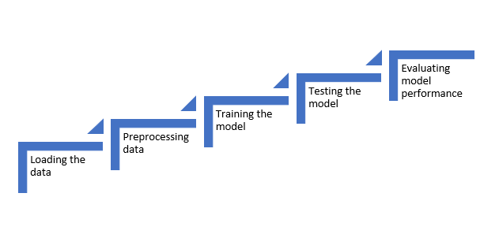
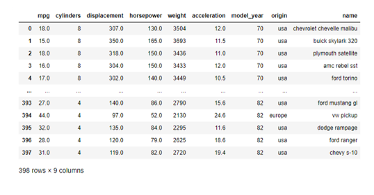
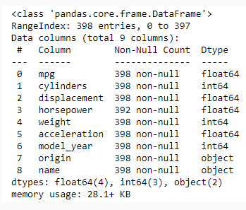
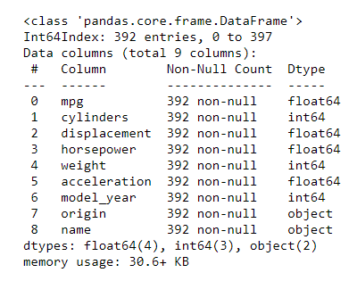
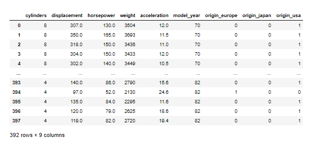
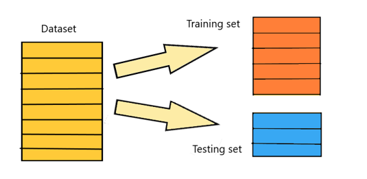

# Scikit-learn

```python
pip install scikit-learn
```

## Machine learning using sklearn

Scikit-learn (also referred as sklearn) is a python library widely used for machine learning. It is characterized by a clean, uniform and streamlined API.

Machine Learning (ML)is a branch of artificial intelligence that aims at building systems that can learn from data, identify patterns and make decisions with minimal human intervention.

The objective here is to introduce the usage of a scikit-learn library for different stages of ML model building.

Let us understand the stages of this process with the following example:

**Problem Statement:**

Engineers at XYZ custom cars now want to create a machine learning model that can predict the mpg of any car that comes to their garage. MPG refers to Miles per gallon. 

**Solution:**

A linear regression model is to be made for this problem. The different stages to be followed in ML Model building is shown below:



Let us start with loading the data:


```python
import pandas as pd
df = pd.read_csv('./TestData/auto_mpg.csv', na_values='?')
print(df)
```



### Data Properties

Let us use DataFrame.info() to get to know about the data properties.

```python
print(df.info())
```



### Dropping null values

It can be observed that the ‘horsepower’ attribute has some null values. The easiest approach is to remove the rows with null values as shown below:

```python
df.dropna(inplace = True)
print(df.info())
```



### Predictors and Target

The target variable is 'mpg' which has to be predicted. The predictors are the variables that are used to predict the target. Here, except name of the car, all the other variables are included as predictors.

```python
# Creating matrix of predictors
X = df.iloc[:, 1:8]
# Creating target
y = df.iloc[:, 0]
```

Since the origin feature is a categorical variable,  `get_dummies` function can be used from Pandas to encode it as shown below:

```python
X = pd.get_dummies(X)
print(X)
```

From the below image, it can be observed that the categorical variable 'origin' has been encoded with 0s and 1s.



The data must be divided into two parts. First, a training set on which model can be trained. Second, a testing set on which the model can be validated.



The Sklearn library is used for this as shown below:

```python
import pandas as pd

df = pd.read_csv('./TestData/auto_mpg.csv', na_values='?')

# Creating matrix of predictors
X = df.iloc[:, 1:8]
# Creating target
y = df.iloc[:, 0]

X = pd.get_dummies(X)
# print(X)

from sklearn.model_selection import train_test_split

X_train, X_test, y_train, y_test = train_test_split(X, y, test_size=0.2, random_state=0)
```

X_train and y_train correspond to training predictors and target respectively. X_test and y_test correspond to testing predictors and target respectively. 'test_size = 0.2' represents that 20% of the data will be used as test set.

Since all the variables in the data are with different units of measurements and different scales, it would be a good idea to standardize them. A standard scaler performs this operation by transforming the columns such that the mean of every column or variable is 0 and standard deviation is 1.

```python
import pandas as pd

df = pd.read_csv('./TestData/auto_mpg.csv', na_values='?')

# Creating matrix of predictors
X = df.iloc[:, 1:8]
# Creating target
y = df.iloc[:, 0]

X = pd.get_dummies(X)
# print(X)

from sklearn.model_selection import train_test_split

X_train, X_test, y_train, y_test = train_test_split(X, y, test_size=0.2, random_state=0)

# Applying standard scaler on the data
from sklearn.preprocessing import StandardScaler

scale = StandardScaler()
X_train = scale.fit_transform(X_train)
X_test = scale.transform(X_test)

# Print the scaled data
print(X_train)
print(X_test)
```

The linear regression model is used to build the model. A linear regression model uses the following equation:

y = B0 + B1*X1 + B2*X2 + _ _ _ _ + Bn*Xn

In this case, y refers to the target and X1,X2…..Xn refer to the predictors. B0 is the intercept  and B1,B2…..Bn are the coefficients.

Below code demonstrates the Linear Regression model building using sklearn library on the training data set.

```python
import pandas as pd
from sklearn.model_selection import train_test_split
from sklearn.preprocessing import StandardScaler
from sklearn.linear_model import LinearRegression
from sklearn.impute import SimpleImputer

# Load the data
df = pd.read_csv('./TestData/auto_mpg.csv', na_values='?')

# Creating matrix of predictors
X = df.iloc[:, 1:8]
# Creating target
y = df.iloc[:, 0]

# Handle categorical variables
X = pd.get_dummies(X)

# Impute missing values
imputer = SimpleImputer(strategy='mean')
X = imputer.fit_transform(X)

# Split the data
X_train, X_test, y_train, y_test = train_test_split(X, y, test_size=0.2, random_state=0)

# Apply standard scaler on the data
scale = StandardScaler()
X_train = scale.fit_transform(X_train)
X_test = scale.transform(X_test)

# Importing and fitting the model on training set
reg = LinearRegression()
reg.fit(X_train, y_train)

# Checking the coefficient(slope) and intercept
m = reg.coef_
c = reg.intercept_
print(m)
print(c)
```
**Output:**
```
[-0.68560801  2.58331685 -0.78107414 -5.62533934  0.51533242  2.79108511
  0.38746101  0.59701554 -0.80157453]
23.574842767295596
```

In the next step, the linear regression model created is used for prediction against the training and testing data set.


### Linear Regression Model Building

1. **Equation of Linear Regression**:
   The linear regression model uses the equation:
   \[
   y = B0 + B1*X1 + B2*X2 + _ _ _ _ + Bn*Xn
   \]
   - \( y \) is the target variable (e.g., miles per gallon (mpg) in a car dataset).
   - \( X_1, X_2, \ldots, X_n \) are the predictor variables (e.g., horsepower, weight, etc.).
   - \( B_0 \) is the intercept.
   - \( B_1, B_2, \ldots, B_n \) are the coefficients for each predictor.

2. **Fitting the Model**:
   ```python
   from sklearn.linear_model import LinearRegression
   reg = LinearRegression()
   reg.fit(X_train, y_train)
   ```
   - This code fits the linear regression model to the training data (`X_train` and `y_train`).

3. **Coefficients and Intercept**:
   ```python
   m = reg.coef_
   c = reg.intercept_
   print(m, c)
   ```
   - `m` represents the coefficients (slopes) for each predictor.
   - `c` represents the intercept.
   - In your case, the output is:
     ```
     m = [-0.38495984, 0.02153876, -0.01273514, -0.00700823, 0.12594429, 0.67774449, 0.93380251, 0.74982838]
     c = -16.8231239860894
     ```

### Example

Let's say we are predicting the mpg of a car based on several features like horsepower, weight, etc. Suppose our dataset has the following predictors:
- \( X_1 \): Horsepower
- \( X_2 \): Weight
- \( X_3 \): Displacement
- \( X_4 \): Acceleration
- \( X_5 \): Model Year
- \( X_6 \): Origin
- \( X_7 \): Cylinders

Using the coefficients and intercept from your model, the equation would be:
\[
\text{mpg} = -16.823 + (-0.385 \times \text{Horsepower}) + (0.022 \times \text{Weight}) + \ldots + (0.750 \times \text{Cylinders})
\]

### Prediction

1. **Predicting on Training Data**:
   ```python
   y_pred_train = reg.predict(X_train)
   ```
   - This code predicts the target variable (mpg) for the training dataset.

2. **Predicting on Testing Data**:
   ```python
   y_pred_test = reg.predict(X_test)
   ```
   - This code predicts the target variable (mpg) for the testing dataset.

### Summary

- **Model Building**: Fit the linear regression model to the training data to find the coefficients and intercept.
- **Prediction**: Use the fitted model to predict the target variable for both training and testing datasets.


### Evaluating Model Performance with R-Squared Score

The R-squared score (also known as the coefficient of determination) is a metric used to evaluate the performance of a regression model. It indicates how well the model's predictions match the actual data. An R-squared score of 1 indicates perfect predictions, while a score of 0 indicates that the model does not explain any of the variability in the target variable.

### Example with Code

Let's go through the provided code step-by-step and explain the evaluation process using the R-squared score.

#### Step 1: Importing Libraries and Loading Data
```python
import pandas as pd
from sklearn.model_selection import train_test_split
from sklearn.preprocessing import StandardScaler
from sklearn.linear_model import LinearRegression
from sklearn.impute import SimpleImputer

# Load the data
df = pd.read_csv('./TestData/auto_mpg.csv', na_values='?')
```
- This code imports the necessary libraries and loads the dataset, treating '?' as NaN values.

#### Step 2: Preparing the Data
```python
# Creating matrix of predictors
X = df.iloc[:, 1:8]
# Creating target
y = df.iloc[:, 0]

# Handle categorical variables
X = pd.get_dummies(X)

# Impute missing values
imputer = SimpleImputer(strategy='mean')
X = imputer.fit_transform(X)
```
- `X` contains the predictor variables, and `y` contains the target variable (mpg).
- Categorical variables are handled using `pd.get_dummies`.
- Missing values in `X` are imputed with the mean of each column.

#### Step 3: Splitting the Data
```python
# Split the data
X_train, X_test, y_train, y_test = train_test_split(X, y, test_size=0.2, random_state=0)
```
- The data is split into training and testing sets with an 80-20 split.

#### Step 4: Scaling the Data
```python
# Apply standard scaler on the data
scale = StandardScaler()
X_train = scale.fit_transform(X_train)
X_test = scale.transform(X_test)
```
- The predictor variables are scaled to have a mean of 0 and a standard deviation of 1.

#### Step 5: Training the Model
```python
# Importing and fitting the model on training set
reg = LinearRegression()
reg.fit(X_train, y_train)

# Checking the coefficient(slope) and intercept
m = reg.coef_
c = reg.intercept_
print(m)
print(c)
```
- A linear regression model is trained on the training data.
- The coefficients (`m`) and intercept (`c`) of the model are printed.

#### Step 6: Making Predictions
```python
# Predicting the target: mpg against the predictors in the training data set
# Predicted data stored in y_pred_train
y_pred_train = reg.predict(X_train)
# Predicting the target: mpg against the predictors in the testing data set
# Predicted data stored in y_pred_test
y_pred_test = reg.predict(X_test)
```
- Predictions are made on both the training and testing datasets.

#### Step 7: Evaluating the Model
```python
from sklearn.metrics import r2_score

# Prediction Accuracy in terms of how close is the predicted value of target: mpg
# to the real value in training data set
r2_S_train = r2_score(y_train, y_pred_train)
print(f"R-squared score for training data: {r2_S_train}")

# Prediction Accuracy in terms of how close the predicted value of target: mpg
# to the real value in testing data set
r2_S_test = r2_score(y_test, y_pred_test)
print(f"R-squared score for testing data: {r2_S_test}")
```
- The R-squared score is calculated for both the training and testing datasets.
- The R-squared score for the training data is 81%, indicating that the model explains 81% of the variability in the training data.
- The R-squared score for the testing data is 83%, indicating that the model explains 83% of the variability in the testing data.

### Summary

- **R-squared Score**: Measures how well the model's predictions match the actual data. Higher values indicate better performance.
- **Training Data**: The model is trained on this data, and the R-squared score indicates how well the model fits the training data.
- **Testing Data**: The model is evaluated on this data, and the R-squared score indicates how well the model generalizes to new, unseen data.

This process helps in understanding the performance of the model and ensures that it is not overfitting or underfitting the data. If you have any further questions or need more details, feel free to ask!

